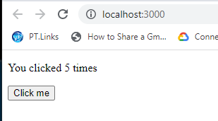

Doing [tutorial](https://blog.fildon.me/publishing-typescript-react-components-to-npm)


```
npm init -y
npm add -D typescript react react-dom @types/react
```
- create package
- create tsconfig.json file

```
{
  "compilerOptions": {
    "strict": true,
    "jsx": "react",
    "declaration": true,
    "esModuleInterop": true,
    "outDir": "dist",
    "target": "es6",
    "module": "es6",
    "moduleResolution": "node"
  },
  "include": ["src"]
}

```

add script to package.json

```
"clean": "rm -rf dist",
"build": "npm run clean && tsc && cp package.json README.md ./dist",
```

- buld it 
```
npm run build
```

publish
```
npm login
npm publish ./dist
```

[npm package site](https://www.npmjs.com/package/productivitytools.learning.typescript.npmpackage)


Component in the host application:

